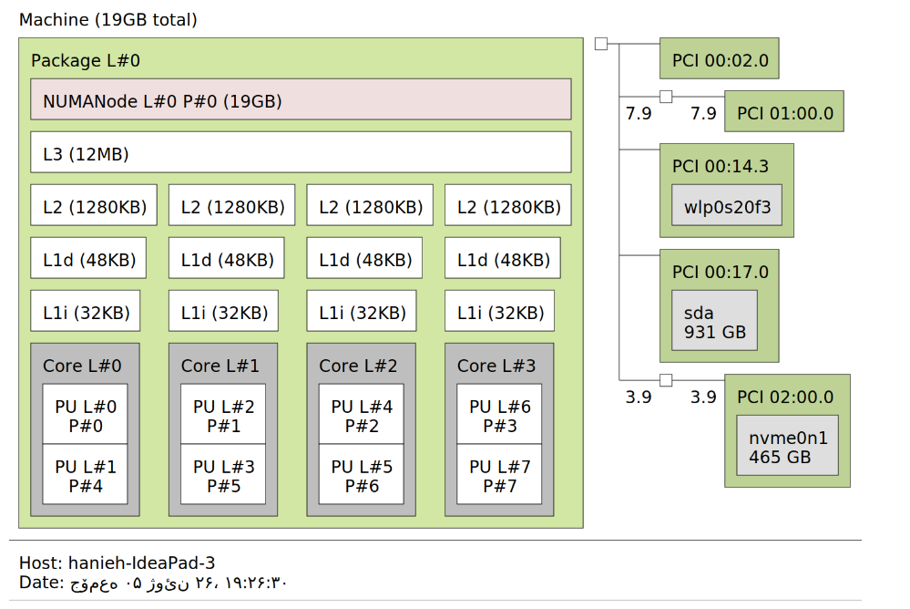

# Redis Cache & Performance Analysis Using `perf`

## Overview

This project analyzes Redis performance from a CPU cache perspective using `perf`.  
The goal is to study how memory locality, working set size, concurrency, and update patterns affect cache behavior (L1/L2/L3/LLC), cache misses, and overall execution performance.

The experiments are designed around real-world memory access patterns and are evaluated using hardware performance counters.

---

## System Topology

The experiments were conducted on the following hardware configuration:

### Key System Characteristics

- Total Memory: 19GB
- 4 Physical Cores / 8 Logical CPUs
- L1d Cache: 48KB per core
- L1i Cache: 32KB per core
- L2 Cache: 1.25MB per core
- Shared L3 Cache: 12MB
- Storage: NVMe SSD + HDD
- NUMA: Single NUMA node

---

## Tools & Methodology

- Redis (in-memory key-value store)
- Python (workload generation)
- `perf stat` (high-level hardware counters)
- `perf record + report` (instruction-level profiling)
- CPU affinity control (taskset)
- System-wide and per-process profiling

---

## Experiments

---

# Scenario 1: Sequential vs Random Access

### Goal
Evaluate the effect of memory locality on cache performance.

### Method
- 100,000 keys inserted into Redis
- Sequential read vs random read
- Measured using `perf stat`

### Key Insight
Redis hash-based lookup minimizes the expected difference between sequential and random access patterns.

| Metric | Sequential | Random |
|--------|-----------:|-------:|
| Cache Miss Rate | 48.54% | 52.14% |
| L1 Miss Rate | 8.49% | 8.73% |
| Execution Time | 33.48s | 31.58s |

### Conclusion
Access pattern has limited effect due to hash-based memory layout.

---

# Scenario 2: Working Set Size

### Goal
Study cache behavior across L1, L2, L3, and beyond cache capacity.

### Method
- Dataset sizes: 100 → 100,000 keys
- Measured cache and pipeline behavior

### Key Insight
Performance degradation becomes significant once working set exceeds L3 cache.

| Dataset | Cache Miss Rate | LLC Miss Rate | IPC |
|--------:|----------------:|--------------:|----:|
| 100 | 18.87% | 15.36% | 0.97 |
| 1,000 | 21.78% | 18.67% | 1.04 |
| 10,000 | 37.97% | 44.01% | 0.95 |
| 100,000 | 53.45% | 68.89% | 0.80 |

### Effect of CPU Affinity

| Metric | Multi-Core | Single-Core |
|--------|-----------:|------------:|
| Cache Miss Rate | 53.45% | 64.69% |
| LLC Miss Rate | 68.89% | 77.51% |

### Conclusion
Cache locality improves with stable core assignment, especially for private cache levels.

---

# Scenario 3: Write / Modification Workloads

### Goal
Analyze cache behavior during update-heavy workloads.

### Method
- 100,000 keys updated
- Fixed-size vs variable-size updates
- Additional test with reduced dataset (100 keys)

### Key Insight
Memory allocation and resizing significantly increase cache pressure.

| Scenario | Cache Miss Rate | LLC Miss Rate |
|----------|----------------:|--------------:|
| Fixed Size | 65.75% | 59.79% |
| Variable Size | 75.43% | 68.84% |

### Working Set Effect

| Dataset | Cache Miss Rate | LLC Miss Rate | IPC |
|--------:|----------------:|--------------:|----:|
| 100K | 75.43% | 68.84% | 0.93 |
| 100 | 6.42% | 5.46% | 1.15 |

### Conclusion
- Resizing increases memory fragmentation and cache misses
- Smaller working sets drastically improve cache efficiency

---

# Scenario 4: Multi-Threaded Workloads

### Goal
Evaluate performance under concurrent access patterns.

### Method
- 1, 4, 8 reader threads
- 2W/2R and 4W/4R mixed workloads

### Key Insight
More threads reduce cache miss rate but increase total execution time due to Redis single-threaded architecture.

| Threads | Cache Miss Rate | Execution Time |
|--------:|----------------:|---------------:|
| 1 | 53.87% | 14.69s |
| 4 | 44.02% | 34.30s |
| 8 | 16.83% | 71.31s |

### Mixed Workload

| Config | Cache Miss Rate | LLC Miss Rate |
|--------|----------------:|--------------:|
| 2W/2R | 40.59% | 58.22% |
| 4W/4R | 16.76% | 31.61% |

### Conclusion
- Parallelism improves cache utilization
- But Redis becomes a synchronization bottleneck
- LLC benefits from shared cache behavior across cores

---

## Overall Conclusions

- Redis performance is dominated by memory hierarchy behavior
- L1 is relatively stable across workloads
- LLC behavior is the main bottleneck at scale
- Working set size has the strongest impact on performance
- Multi-threading improves cache efficiency but not execution time
- Hash-table-based design reduces sensitivity to access patterns

---

## Author

Computer Engineering Student
Performance Analysis Project using `perf`