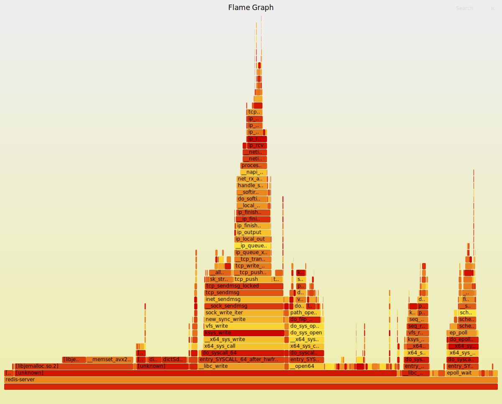
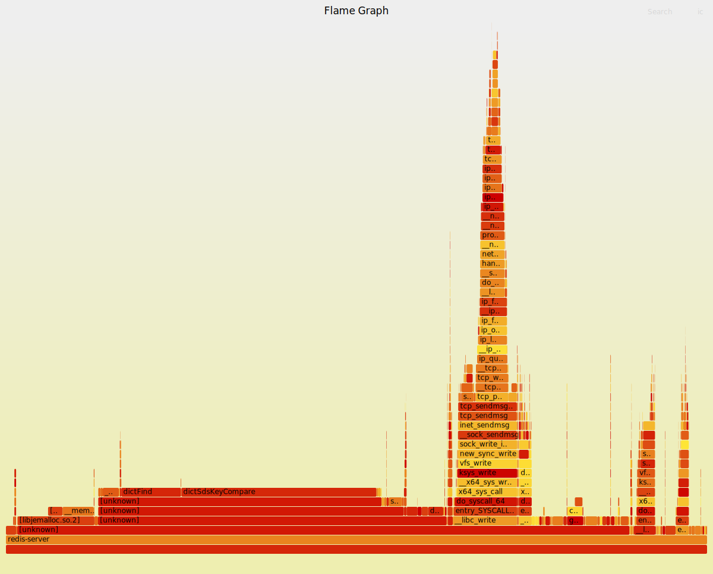

# Scenario 2: Working Set Size

## Objective

The purpose of this experiment is to investigate how the size of the working set affects cache performance in Redis. By gradually increasing the dataset size, we can observe how cache behavior changes as the working set exceeds the capacity of different cache levels.

## Cache Hierarchy

The cache sizes of the test machine were obtained using:

```bash
lscpu | grep cache
```

Output:

| Cache Level          | Size    |
| -------------------- | ------- |
| L1 Data Cache        | 192 KiB |
| L1 Instruction Cache | 128 KiB |
| L2 Cache             | 5 MiB   |
| L3 Cache             | 12 MiB  |

Since the processor contains four cores, the effective cache capacity available per core for the private cache levels (L1 and L2) is approximately one quarter of the reported values.

## Estimating Memory Usage per Key

First, the memory consumption of an empty Redis instance was measured:

```bash
redis-cli INFO memory | grep used_memory:
```

Output:

```text
used_memory:858528
```

After inserting 1,000 keys, memory usage became:

```text
used_memory:945920
```

Therefore:

```text
(945920 - 858528) / 1000 = 87.392 bytes
```

Each Redis entry occupies approximately **87 bytes** of memory.


## Measuring Stall Cycles

When using `perf stat` in per-thread mode (`-p`), several Top-Down Analysis events, including stall-cycle-related metrics, are not available.

Since Redis was the only CPU-intensive process running during the experiment, Top-Down metrics were collected separately using system-wide mode (`-a`). The remaining cache-related events were measured in per-thread mode.

## Results

### Cache Performance

| Metric | 100 Keys | 1,000 Keys | 10,000 Keys | 100,000 Keys | 1,000,000 Keys |
|----------|----------------:|----------------:|----------------:|----------------:|----------------:|
| Cycles | 4,416,722,703 | 4,068,964,693 | 5,240,609,472 | 5,682,117,287 | 6,766,692,331 |
| Instructions | 4,397,930,741 | 4,028,288,349 | 4,345,851,422 | 4,409,058,241 | 5,279,999,545 |
| IPC | 1.00 | 0.99 | 0.83 | 0.78 | 0.78 |
| cycle_activity.stalls_l1d_miss | 432,959,096 | 387,460,842 | 1,058,203,239 | 1,644,532,329 | 2,384,413,205 |
| cycle_activity.stalls_l2_miss | 167,494,356 | 146,686,148 | 769,747,856 | 1,402,422,635 | 2,109,666,879 |
| cycle_activity.stalls_l3_miss | 138,813,830 | 110,859,219 | 713,023,099 | 1,327,567,945 | 1,960,600,242 |
| cycle_activity.stalls_mem_any | 1,102,905,792 | 977,945,927 | 1,722,395,633 | 2,268,759,116 | 3,068,200,443 |
| Cache References | 10,222,594 | 8,967,934 | 14,257,350 | 15,708,907 | 28,142,096 |
| Cache Misses | 2,786,973 | 2,444,719 | 5,467,843 | 8,800,941 | 17,714,226 |
| Cache Miss Rate | 27.26% | 27.26% | 38.35% | 56.03% | 62.95% |
| L1 Loads | 1,268,468,607 | 1,143,227,209 | 1,232,567,688 | 1,245,974,774 | 1,451,903,519 |
| L1 Load Misses | 117,719,782 | 99,905,505 | 120,057,020 | 110,694,175 | 112,982,015 |
| L1 Miss Rate | 9.28% | 8.74% | 9.74% | 8.88% | 7.78% |
| L2 RQ Misses | 10,584,827 | 9,078,581 | 15,015,097 | 17,012,043 | 33,421,362 |
| LLC Loads | 1,021,156 | 1,100,785 | 2,323,932 | 3,143,649 | 6,502,083 |
| LLC Load Misses | 207,403 | 254,569 | 1,088,302 | 2,126,825 | 4,516,249 |
| LLC Miss Rate | 20.31% | 23.13% | 46.83% | 67.65% | 69.46% |
| Execution Time (s) | 30.0016 | 30.0017 | 30.0011 | 30.0012 | 30.0015 |

### Top-Down Analysis

| Metric          | 100 Keys (L1) | 1,000 Keys (L2) | 10,000 Keys (L3) | 100,000 Keys (>L3) | 1,000,000 (>>L3)
| --------------- | ------------: | --------------: | ---------------: | -----------------: | -----------------:
| Retiring        |         27.3% |           27.5% |            27.1% |              27.1% |  25.2%
| Bad Speculation |          8.6% |            9.1% |             8.7% |               8.8% |   9.1%
| Frontend Bound  |         49.7% |           47.3% |            48.5% |              47.1% |   48.2%
| Backend Bound   |         14.3% |           16.1% |            15.7% |              17.0% |   17.4%

## Analysis

As the working set grows beyond the capacity of higher cache levels, cache efficiency gradually decreases.

The overall cache miss rate increases from **18.9%** when the dataset fits within L1 cache to **53.5%** when the dataset exceeds the L3 cache capacity. A similar trend can be observed in LLC miss rates, which increase dramatically from **15.4%** to **68.9%**.

Instruction throughput also decreases. IPC drops from approximately **1.0** to **0.8**, indicating that the processor spends more cycles waiting for memory accesses rather than executing useful instructions.

The Top-Down analysis shows that the workload remains heavily **frontend-bound**, with nearly half of the execution time spent waiting for instruction delivery. However, the percentage of **backend-bound** cycles increases as the dataset grows, suggesting additional delays caused by memory accesses and cache misses.

Overall, the results clearly demonstrate that larger working sets reduce cache effectiveness and increase memory-access latency.

## Effect of CPU Core Affinity

### Initial Setup

To ensure controlled and repeatable measurements, the Redis server is pinned to a specific CPU core.

First, we check the current CPU affinity of the Redis process:

```bash
sudo taskset -cp <pid>
````

Example output:

```text
pid 6571's current affinity list: 0-7
```

Then, we restrict the process to run only on **CPU core 2**:

```bash
sudo taskset -cp 2 6571
```

After applying the change, the affinity becomes:

```text
pid 6571's current affinity list: 0-7  
pid 6571's new affinity list: 2
```

### Purpose

This setup is used to:

* Reduce scheduling noise across multiple CPU cores
* Improve consistency of cache-related measurements
* Ensure more accurate analysis of L1/L2 cache behavior on a single core

```
```

To evaluate the impact of CPU migration, the experiment with 100,000 keys was repeated while forcing Redis to run on a single CPU core.

### Comparison

| Metric          | Multiple Cores | Single Core |
| --------------- | -------------: | ----------: |
| Cycles          |          5.47B |       5.64B |
| Instructions    |          4.40B |       4.60B |
| IPC             |           0.80 |        0.82 |
| Cache Miss Rate |         53.45% |      64.69% |
| L1 Load Misses  |        112.50M |     113.05M |
| L1 Miss Rate    |          9.01% |       8.66% |
| LLC Load Misses |          2.07M |       2.10M |
| LLC Miss Rate   |         68.89% |      77.51% |
| Execution Time  |        30.00 s |     30.00 s |

## Analysis

The L1 cache miss rate is slightly lower when Redis is pinned to a single CPU core. When a process migrates between cores, the private L1 cache of the new core must be populated again, which can introduce additional cache misses.

In contrast, the LLC (L3 cache) is shared among all cores. Therefore, CPU migration has a smaller impact on the availability of data in the last-level cache.

These results suggest that cache locality can benefit from CPU affinity, particularly for the private cache levels, although the overall impact on execution time remains relatively small in this workload.


## Instruction-Level Cache Miss Analysis Using `perf record`

While `perf stat` provides aggregate cache statistics, it does not reveal which parts of the Redis code are responsible for the observed cache misses. To identify the most expensive memory-access patterns, instruction-level profiling was performed using `perf record`.

For the dataset containing 100 keys, cache misses were recorded using:

```bash
sudo perf record -p <pid> -g -e cache-misses:P
```

The collected samples were stored in `perf.data` and analyzed using:

```bash
perf report
```

The report shows the percentage of cache-miss samples attributed to different functions and instructions.

### 1. `lookupKey`

The first function examined was `lookupKey`, which implements the main key lookup routine in Redis.

A heavily sampled instruction sequence was:

```asm
mov     %eax,%edx
movzbl  (%r12),%eax
or      %edx,%eax
mov     %eax,(%r12)
```

Approximately 85% of the cache-miss samples in this code path were associated with this sequence.

The highlighted instructions perform the following operations:

1. Load a value from the memory address stored in `r12`.
2. Combine it with the value in `edx`.
3. Write the result back to the same memory location.

It is important to note that the percentage shown next to the `or` instruction does not imply that the `or` operation itself caused the cache miss. The `or` instruction does not access memory. Instead, the cache miss occurred during the preceding memory load, and the sampled event happened to be attributed to the next instruction when execution resumed.

### 2. `dictFind`

The second important function was `dictFind`, which is responsible for locating a key inside Redis's hash table implementation.

One of the most frequently sampled instruction sequences was:

```asm
mov     0x10(%r12),%r12
test    %r12,%r12
je      ...
```

This code performs linked-list traversal by following pointers between hash table entries.

The presence of this code confirms that Redis stores keys using a hash-table-based data structure. Every `GET` request eventually reaches this lookup routine.

Pointer chasing is particularly expensive for cache performance because the processor cannot easily predict where the next node will reside in memory. Since linked-list nodes may be scattered throughout the heap, each pointer dereference can potentially trigger a cache miss.

### 3. `__memset_avx2_erms`

Another frequently sampled function was `__memset_avx2_erms`.

This routine is part of the standard C library and is invoked whenever a memory region must be initialized or filled with a specific value. Since it operates on large memory regions, it naturally generates a significant amount of memory traffic and may contribute to cache misses.

### 4. `dictSdsKeyCompare`

The `dictSdsKeyCompare` function is responsible for comparing keys stored within a hash-table bucket.

When a command such as:

```text
GET key123
```

is executed, Redis first computes the hash value of `key123` and uses it to locate the corresponding bucket. If multiple keys are stored in that bucket due to hash collisions, Redis invokes `dictSdsKeyCompare` to compare the candidate keys byte-by-byte until the correct key is found.

This comparison process may generate additional cache misses because the actual string contents are stored separately from the hash table entry and must be fetched through pointers.


1000


100_000 keys

## Memory Access Path During a Redis Lookup

The instruction-level analysis reveals the sequence of memory accesses involved in a typical Redis lookup:

1. **Hash Table Lookup**

   * Redis accesses the hash table and locates the bucket corresponding to the requested key.
   * If the bucket is not already cached, a cache miss may occur.

2. **Hash Bucket Traversal**

   * The bucket may contain multiple entries.
   * Redis traverses linked structures to inspect each candidate entry.
   * Since these entries are often distributed throughout the heap, pointer chasing can cause additional cache misses.

3. **Key Comparison**

   * Redis compares the requested key against the keys stored in the bucket.
   * The actual string data is accessed through pointers, introducing further memory accesses and potential cache misses.

4. **Value Retrieval**

   * After locating the correct key, Redis retrieves the associated value.
   * The value itself is typically referenced through another pointer rather than being stored directly inside the hash-table entry.
   * This final dereference may result in another cache miss.

Overall, the profiling results indicate that cache misses are primarily caused by pointer-heavy data structures and indirect memory accesses rather than by computational instructions. The hash-table lookup process itself is relatively efficient, but the required pointer dereferences and heap accesses introduce latency that becomes increasingly visible as the working set grows beyond cache capacity.
